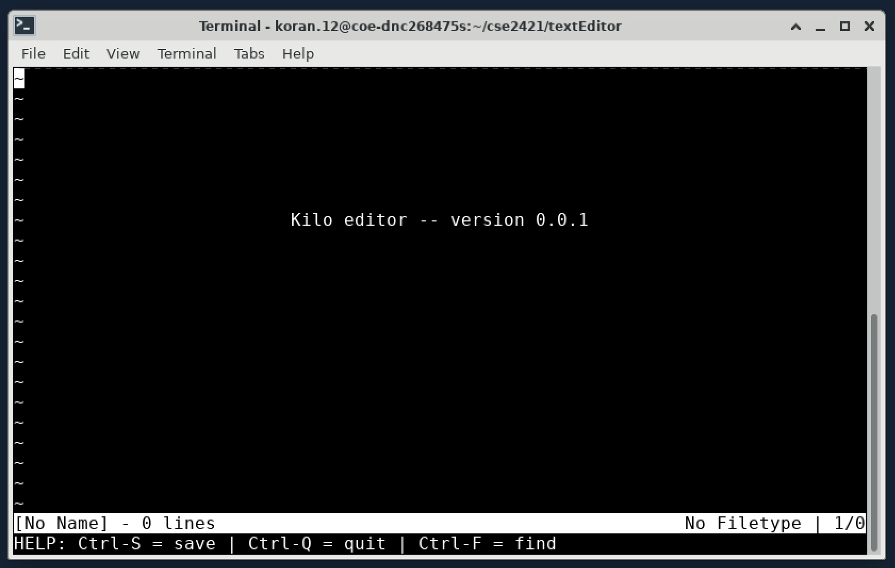
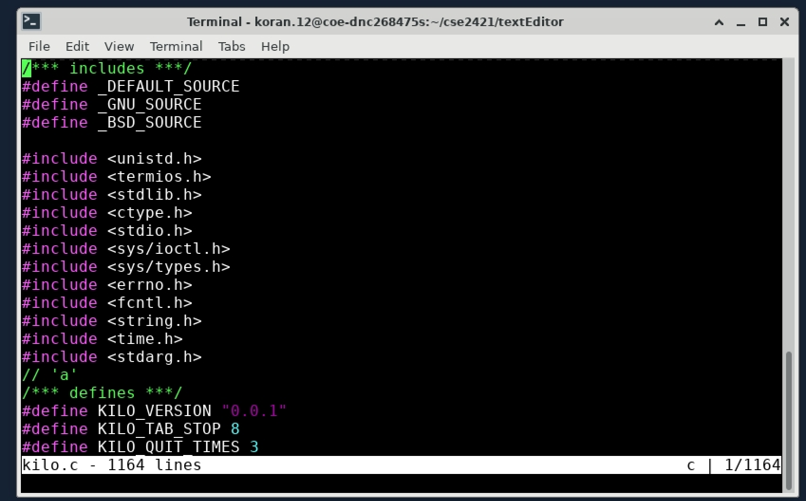

Text Editor
===
  In order to create this text editor I followed along with the tutorial published to https://viewsourcecode.org/snaptoken/kilo/index.html. This text editor is less than 1K lines of code and does not depend on any library. In order to better familiarize myself with linux and the command line I developed this project within Ohio State University's virutal linux enviroment. 

The text editor allows the use of commands:

CTRL-S: Save, if the user hasn't saved yet they will be prompted to input a filename
CTRL-Q: Quit
CTRL-F: Find string in file (use arrow keys to navigate to next or prev)

In order to run this program run the command 'make kilo'. Then './kilo' which will open a blank text file like so:

The user can also run './kilo <filename>' to open a pre-existing file. For example 
'./kilo kilo.c' will open the source code of this project:

  
